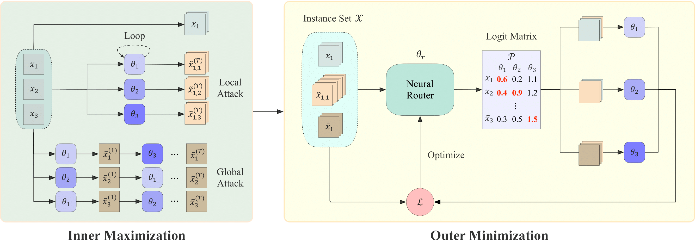

<h2 align="center"> Collaboration! Towards Robust Neural Methods for Routing Problems </h2>

<p align="center">
      <a href="https://openreview.net/forum?id=YfQA78gEFA"></a>&nbsp;&nbsp;&nbsp;&nbsp;<a href="https://arxiv.org/pdf/2410.04968"></a>&nbsp;&nbsp;&nbsp;&nbsp;<a href="https://nips.cc/Conferences/2024"></a>&nbsp;&nbsp;&nbsp;&nbsp;<a href="https://github.com/RoyalSkye/Routing-CNF/blob/main/LICENSE"></a>
  </p>

The PyTorch Implementation of *NeurIPS 2024 -- [Collaboration! Towards Robust Neural Methods for Routing Problems](https://arxiv.org/pdf/2410.04968)*. This paper improves the robustness of neural VRP solvers through adversarial training, which can also be viewed as enhancing their OOD generalization from the perspective of adversarial robustness (see [ICLR'22](https://openreview.net/forum?id=vJZ7dPIjip3)).

<p align="center"></p>

## Dependencies

* Python >= 3.8
* Pytorch >= 1.12
* gurobipy

## How to Run

```shell
# Example: POMO/TSP
nohup python -u train.py 2>&1 &
trainer_params["method"] = "ours"  # CNF (3)
trainer_params["method"] = "baseline"  # POMO_AT (3)
trainer_params["method"] = "baseline_hac"  # POMO_HAC (3)
```

## Citation

```tex
@inproceedings{zhou2024collaboration,
    title={Collaboration! Towards Robust Neural Methods for Routing Problems},
    author={Jianan Zhou and Yaoxin Wu and Zhiguang Cao and Wen Song and Jie Zhang and Zhiqi Shen},
    booktitle={Advances in Neural Information Processing Systems},
    year={2024}
}
```

## Acknowledgments

* https://github.com/yd-kwon/POMO
* https://github.com/wondergo2017/TSP-HAC
* https://github.com/yd-kwon/MatNet
* https://github.com/Thinklab-SJTU/ROCO
* https://github.com/johannaSommer/generalization-neural-co-solvers

